# 프로젝트명: 한디아나존스 README

> `우리나라 약 1,7000개에 달하는 방대한 문화재를 웹 페이지의 지도 위에서 모두 탐방해 나갈 수 있는 역사 교육 & 문화재 데이터 관리 및 사용방안 제고 & 온라인 관광사업 활성화 목적의 웹페이지 입니다.`

`개발환경`

- Vue.js / Sts 3.9.14 / MySQL

## 프로젝트 선정 배경

### 저조한 역사 인식 수준

- 한국의 초, 중, 고등학교 학생 및 대학교 학생들은 대부분 한국사를 암기위주로 공부해 휘발성 지식에 가깝다.
- 더불어 한국 학생들의 전반적인 역사 인식 수준이 매우 낮은 것으로 나타났다.
- 때문에 사람들이 한국 역사를 재미있게 학습해 나갈 수 있도록 프로젝트를 기획했다.

### 역사인식 제고를 통한 외국의 한국 문화재 뺏기 방지에 기여

- 역사 중요성에 대한 전반적인 인식 수준을 높여 외국의 한국문화자 뺏기(Ex. 동북공정) 방지에 이바지한다.

### 데이터 시대 속 문화재 데이터 관리와 활용법 향상

- 4차산업 시대가 도래해 데이터의 양이 방대해지고 그 중요성이 커지고 있는 요즘, 쌓여만 가는 문화재 데이터를 효율적으로 활용할 수 있는 방안이 부재
- 프로젝트를 진행하면서 데이터베이스에 문화재 데이터를 필요한 값만 추출해 효율적으로 저장 관리하고, 이를 바탕으로 지도 위에서 한국 문화재를 탐방해 나갈 수 있게끔 활용방안 제시

### 코로나로 인해 치명타를 입은 관광사업의 온라인 시장 진출 방안 제시

- 코로나로 인해 오프라인 사업 중 대표적 사업인 관광사업이 치명타를 입음
- 온라인 상에서 한국 문화재를 탐방하며 관광을 할 수 있게끔 대안을 제시 - 추후 지역 상점들과 연결하여 온라인 상품 구매가 가능하도록 응용도 가능

## 기능 명세서 작성

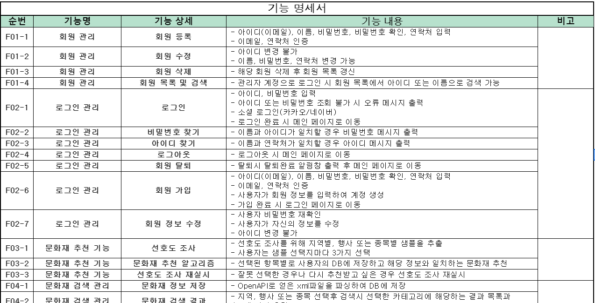

- 웹 제작에 앞서 구현해야할 기능들을 기획하고 세부 기능별 기능 명세서를 작성했다.
- 프로젝트 진행 동안 누락되거나 놓치는 부분없이 원활히 작업을 수행하기 위해 작성.

## 협업 툴 준비 및 세팅

###### Jira

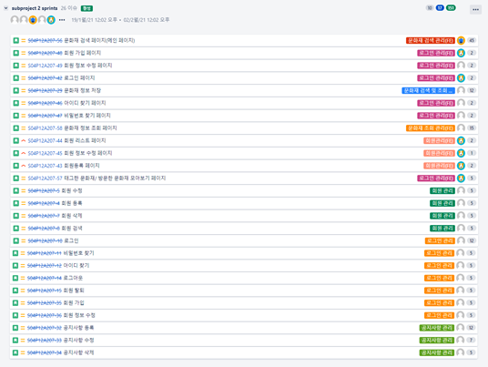

- Jira를 생성하고 기능 명세서를 중심으로 수행할 작업 목록을 생성했다.
- Spirnt를 이용해 할일, 작업중인 일, 완료한 일을 체계적으로 정리하며 작업을 수행했다.
- 이후 팀 프로젝트 Gitlab을 MM에 연동하고 Jira도 연동을 완료했다. - Jira와 Gitlab에서 작업이 일어나면 알림이 MM으로 Push 되는 것을 확인할 수 있었다.

## 프로젝트 전체 설계도

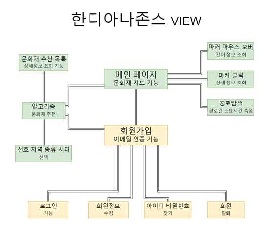

- VIEW(프론트 앤드) 페이지의 구조와 관계도를 잡아봤다.

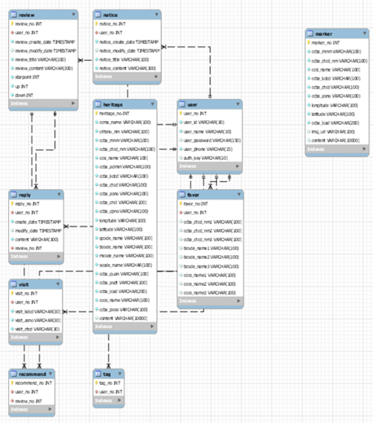

- DB(데이터베이스) ERD도 만들어봤다.

## 개발 수행 내용

### 문화재청 제공 문화재 정보 데이터 로드

- [문화재청 문화재 Open API 주소](https://www.cha.go.kr/html/HtmlPage.do?pg=/publicinfo/pbinfo3_0201.jsp&mn=NS_04_04_02)

###### 홈페이지 데이터 설명서 확인

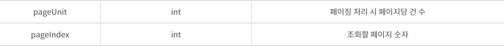

- 문화재 정보 Open API 요청을 위한 기본 url 정보와 그 외 요청 파라미터 값들을 확인한다.

- 우선 전체 페이지 조회를 위한 'pageUnit'과 'pageIndex' 파라미터 외에 필요한 파라미터 정보들은 홈페이지의 `활용정보`에서 확인할 수 있다.

- 데이터를 받아오기 위한 코드를 짜기 전, 전체 파라미터 사용법과 전체 데이터의 양을 확인하기 위해 웹상에서 요청파라미터 인자들을 넣어 데이터를 html 형식으로 확인해 봤다.

  - 파라미터를 넣은 검색주소: http://www.cha.go.kr/cha/SearchKindOpenapiList.do?pageUnit=900&pageIndex=18
  - 페이지 하나동 조회 정보의 개수를 900으로 놓고 18페이지를 조회하면 가장 마지막 데이터인 16054번째의 데이터를 확인할 수 있다.

###### 요청 파라미터 확인

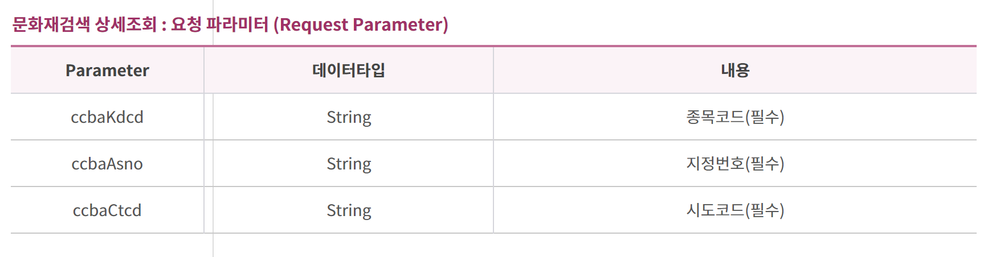

###### 파이썬을 이용해 가져온 문화재 데이터 결과물 조회

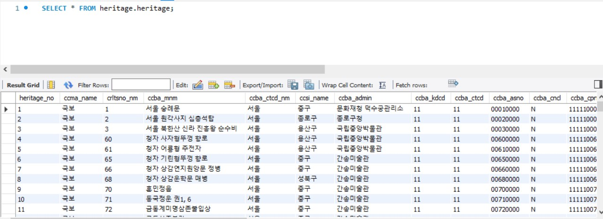

- 국민 대부분이 알고있는 유명한 문화재부터 잘 알려지지 않은 마이너(Minor)한 문화재 데이터까지 모두 담고있어, 방대한 양의 문화재 탐방이 가능하다 

`참조한 주요 공식문서`

- [python xml.etree.ElementTree 공식문서](https://docs.python.org/3/library/xml.etree.elementtree.html#xml.etree.ElementTree.Element)

_____

# 주요 기능 및 화면

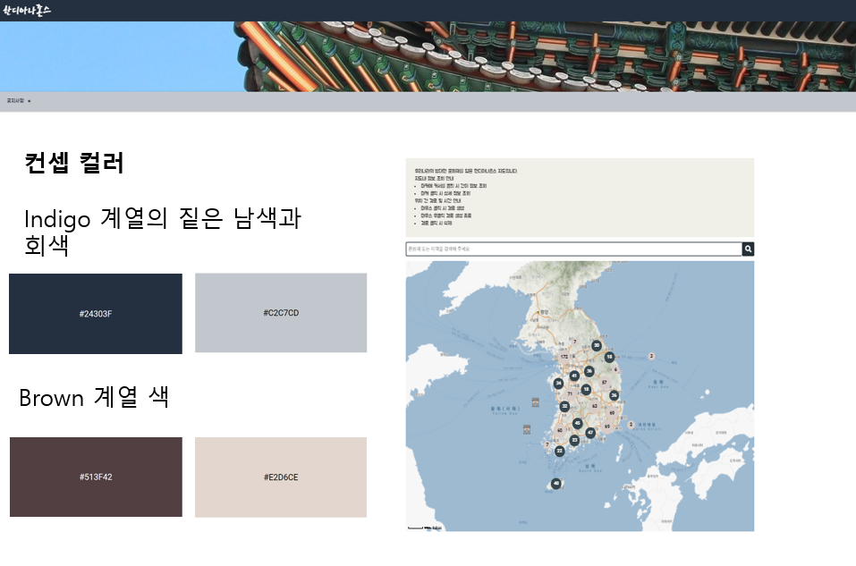

- 웹 제작에 앞서 전체 컨셉 컬러와 구조를 짜고 제작.

###### 메인 페이지

- 서비스의 핵심 기능을 부각시킨 **메인 화면의** **디자인**
- 우리 프로젝트의 메인 컬러인 `darken navy`와 `lighten brown` 의 컬러를 부각시켰다.
- 메인 페이지 로딩 시 총 1000개의 지역별 주요 문화재를 클러스터 형태로 랜덤으로 보여준다. (새로고침 시 새로운 문화재 조회 가능)
- 검색 하나로 한국에 있는 모든 문화재의 위치와 상세 정보를 조회 가능
- 사용자 편의를 위한 문화재 지도 사용법 설명도 넣어놨다.

###### 메인 페이지에서의 문화재 정보 조회

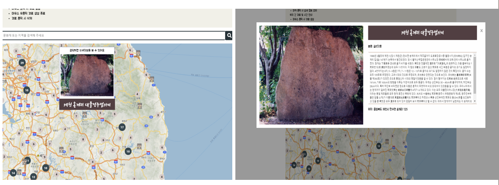

- 마커에 마우스 오버 시 해당 문화재의 간이 정보 모달 생성 
- 마커 클릭 시 해당 문화재의 상세 정보 모달 생성

###### 문화재 이름 검색 기능

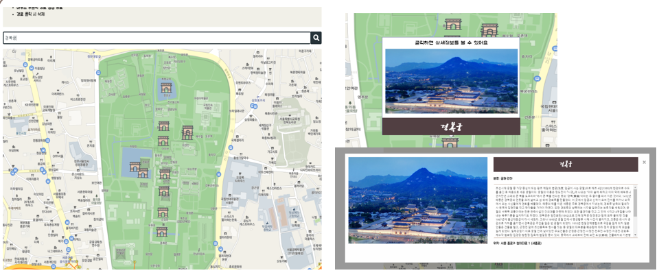

- 검색 예시: 경복궁
- 원하는 문화재 이름을 검색하면 해당 위치로의 지도 이동과 함께 검색어에 관련된 문화재의 마커를 보여준다.

###### 문화재 지역명 검색 기능

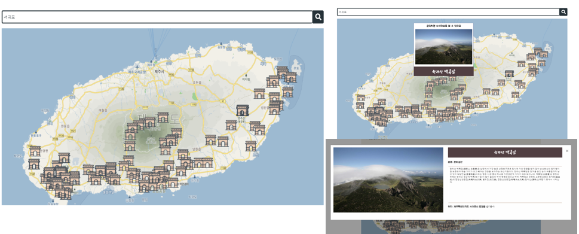

- 검색 예시: 서귀포
- 궁금한 지역의 이름을 검색하면 해당 위치로의 지도 이동과 함께 해당 지역에 속하는 문화재 마커를 보여준다.

###### 이동 경로 계산 기능

- 탐방을 원하는 문화재 사이의 거리를 계산해 거리와 이동 수단별 대략적인 이동시간을 알려준다.
- 원하는 지점들을 왼쪽 클릭하면 경로가 생성되고, 오른쪽 클릭하면 경로가 완성된다.
- 완성된 경로를 다시 왼쪽 클릭하면 경로 삭제 가능

###### Auth 관련 페이지

**사용자 친화적 웹페이지를 구성하기 위해 페이지 전환 최소화를 목표로 했다. **

**회원가입, 로그인, 아이디 찾기, 비밀번호 찾기 등 필수 페이지들은 페이지 전환 없이 모달 형식으로 띄우도록 했다.**

`회원가입`(이메일 인증 기능 구현)

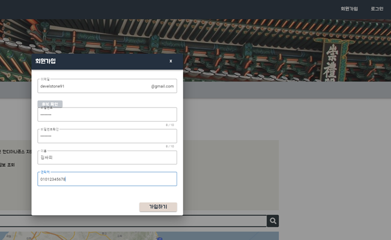

- 헤더 우측 상단에 회원가입 버튼을 누르면 회원가입을 할 수 있는 모달이 생성된다.
- 회원가입은 Gmail로만 가능하며, 가입하기 버튼을 누르면 입력한 이메일 주소로 인증 메일 요청이 발송된다.
  이메일 인증 확인 버튼을 누르면 이메일 인증이 완료되고, 계정을 사용할 수 있게 된다.

`기타 Auth 기능`

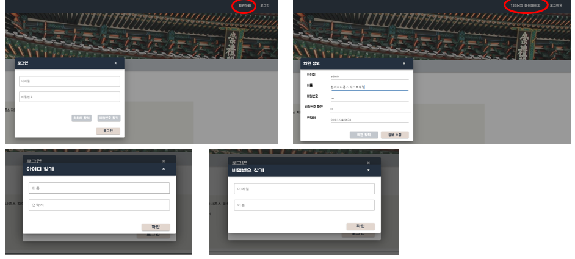

- 헤더 우측 상단에 로그인 버튼을 누르면 로그인을 할 수 있는 모달이 생성된다. 
- 로그인 후 개인 정보수정 및 회원탈퇴 등이 가능하다.
- 아이디 찾기와 비밀번호 찾기도 가능

###### 사용자 맞춤 문화재 추천 기능

`선호도 선택`

- 지역, 문화재 종류, 시대 별로 개인의 선호 정보를 입력하면 이에 맞는 문화재를 추천해주는 기능입니다.
- 해당 기능은 로그인한 유저에 한해서 이용 가능합니다.
- 좌측 메뉴 목록에 ‘문화재 추천을 위한 선호 정보 입력‘을 클릭하면 선호하는 지역을 선택할 수 있는 창이 생성됩니다. 
- 지역, 문화재 종류(카테고리), 역사 시대 별로 세 개의 선호하는 항목을 선택한 후 ‘다음으로’를 클릭합니다.

`문화재 추천 목록 조회`

- 입력한 선호 정보를 바탕으로 해당 유저에게 문화재 추천 목록을 보여줍니다.
- ‘더보기’ 클릭 시 해당 문화재의 상세 정보를 조회 할 수 있습니다. 

> `그 외 공지사항 작성 등 기타 필수 기능들을 구현해 봤습니다. 자세한 사항은 직접 홈페이지를 방문 혹은 파일을 실행해 확인해주세요.`

_______

## 배포

> `배포 사이트 주소`:   http://i4a207.p.##### (별도 요청시 알려드립니다.)

- 만료기한이 존재하는 점 유의부탁드립니다.

###### AWS(EC2) 서버에 Docker Container를 업로드해 배포